### Ask not “How can we make the Web infrastructure smarter?” 
## But ask “What can the Web infrastructure provide to improve the consistency and availability of Web data?"
A Connected Web Is a Smarter Web. 
<BLOCKQUOTE>“we need a Web infrastructure that lets us connect data to smart Web applications
so that the whole Web experience is enhanced. The Web seems smarter because smart applications can get the data they need.
</BLOCKQUOTE>

### When we speak of “semantics” of natural language, we often refer to something about what it means to understand the utterance—how to go from the structured letters or sounds in a language to some kind of meaning behind them.

* That is, given that symbols can refer to things in the world, how can we build models from those symbols that help us to capture, understand, and communicate what we know about relationships between those things?

* In the Semantic Web we refer to the things in the world as resources; a resource can be anything that someonemight want to talk about.
Followings are all examples of things someonemight talk about and that can be resources in the SemanticWeb.

### With data-backed Web applications, the Semantic Web infrastructure allows the data to drive the presentation so that various webpages (presentations) can provide views into a consistent body of information. In this way, the Semantic Web helps data not be so dumb.

### From a technical point of view, the Semantic Web consists primarily of three technical standards(RDF, SPARQL, OWL):

•	RDF (Resource Description Framework): The data modeling language for the Semantic Web. All Semantic Web information is stored and represented in the RDF.

•	SPARQL (SPARQL Protocol and RDF Query Language): The query language of the Semantic Web. It is specifically designed to query data across various systems.

&nbsp;  A Query Language for RDF Graph Traversal (SPARQL Query Language Specification)

&nbsp;  A Protocol Layer, to use SPARQL via http (SPARQL Protocol for RDF Specification)

&nbsp;  An XML Output Format Specification for SPARQL Queries (SPARQL Query XML Results Format)

•	OWL (Web Ontology Language) The schema language, or knowledge representation (KR) language, of the Semantic Web. OWL enables you to define concepts composably so that these concepts can be reused as much and as often as possible. Composability means that each concept is carefully defined so that it can be selected and assembled in various combinations with other concepts as needed for many different applications and purposes.

## There are three ways of Semantic Web notations as follows.

> Subject X is "Harald" and Object(Literal) Y is "++49-331-5509-927", which is “the value of X,” and Predicate, P is “phone”

> Subject X is "Harald" and Object(Resource) Y is "http://harald.blogspot.com/", which is “the value of X,” and Predicate, P is “weblog”

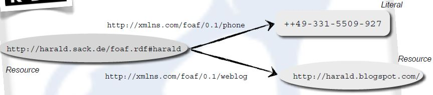

### 1.  N-Triples Notation

• URIs/IRIs in angle brackets

• Literals in quotation marks

• Triple ends with a period

> <http://harald.sack.de/foaf.rdf#harald> <http://xmlns.com/foaf/0.1/phone> “+  
> +49-331-5509-927“ . 
> <http://harald.sack.de/foaf.rdf#harald> <http://xmlns.com/foaf/0.1/weblog> 
> <http://harald.blogspot.com/> .

### 2. Turtle (Terse RDF Tripel Language) Notation
> @prefix foaf: <http://xmlns.com/foaf/0.1/> . 
> @base <http://harald.sack.de/foaf.rdf> 
> <#harald> foaf:phone “++49-331-5509-927“ . 
> <#harald> foaf:weblog <http://harald.blogspot.com/> .

* Below "Turtle Notation with ;" has same result with above Trutle Notation : semicolon indicates that subsequent triples have the same subject

> @prefix foaf: <http://xmlns.com/foaf/0.1/> . 
> @base <http://harald.sack.de/foaf.rdf> 
> <#harald> foaf:phone “++49-331-5509-527“ ; foaf:weblog <http://semweb2014.blogspot.com/> .

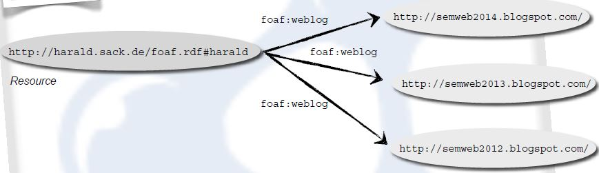

* comma indicates that subsequent triples have same subject and property (object list)

> @prefix foaf: <http://xmlns.com/foaf/0.1/> . 
> <#harald> foaf:weblog <http://semweb2014.blogspot.com/> , 
> <http://semweb2013.blogspot.com/> , 
> <http://semweb2012.blogspot.com/> . 

* Typed literal

> @prefix lec: <http://hpi-web.de/Lecture#> . 
> <http://hpi.web.de/Spring14#KE> 
> lec:name “Knowledge Engineering“^^<http://www.w3c.org/2001/XMLSchema#string> ; 
> lec:hours “4“^^<http://www.w3c.org/2001/XMLSchema#integer> . 

* Anonymous Blank Nodes

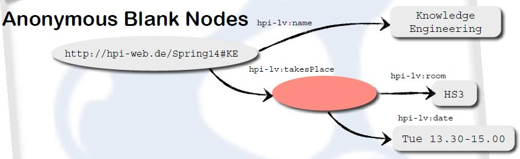

> @prefix hpi-lv: <http://hpi-web.de/Lecture#>. 
> <http://hpi-web.de/Spring14#KE> hpi-lv:name "Knowledge Engineering"; 
> hpi-lv:takesPlace [ 
> hpi-lv:date "Tue 13.30-15.00"; 
> hpi-lv:room "HS3" ] .

* Deferencable Blank Nodes

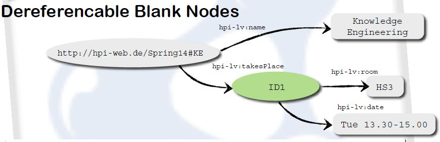

> @prefix hpi-lv: <http://hpi-web.de/Lecture#>. 
> <http://hpi-web.de/Spring14#KE> hpi-lv:name "Knowledge Engineering"; 
> hpi-lv:takesPlace _:ID1 . 
> _:ID1 hpi-lv:date "Tue 13.30-15.00"; 
> hpi-lv:room "HS3" .

#### * RDF-Collection

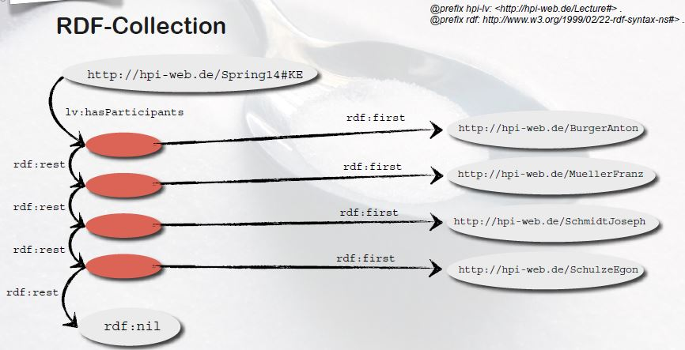

> @prefix rdf: <http://www.w3.org/1999/02/22-rdf-syntax-ns#> . 
> @prefix lv: <http://hpi-web.de/Lecture#> . 
> @base <http://hpi-web.de/>. 
> <Sprint14#KE> lv:hasParticipant [ 
> rdf:first <BurgerAnton>; rdf:rest [ 
> rdf:first <MuellerFranz>; rdf:rest [ 
> rdf:first <SchmidtJoseph>; rdf:rest [ 
> rdf:first <SchulzeEgon>; 
> rdf:rest rdf:nil 
> ] ] ] ] .

#### * RDF-Reification

rdf:Statement defines an RDF Statement, consisting of Subject, Predicate and Object

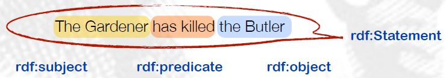

Sherlock Holmes supposes that the Gardener has killed the Butler

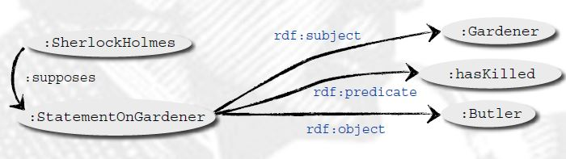

> @prefix rdf: <http://www.w3.org/1999/02/22-rdf-syntax-ns#> . 
> @prefix : <http://example.org/Crimestories#> . 
> :SherlockHolmes :supposes :StatementOnGardener . 
> :StatementOnGardener a rdf:Statement ; 
> rdf:subject :Gardener ; 
> rdf:predicate :hasKilled ; 
> rdf:object :Butler .

### 3. RDF/XML Notation
> <xml version=“1.0“ encoding=“utf-8“>  
> <rdf:RDF xmlns:rdf="http://www.w3.org/1999/02/22-rdf-syntax-ns#“  
> xmlns:foaf=“http://xmlns.com/foaf/0.1/“ >  
> <rdf:Description rdf:about=“http://harald.sack.de/foaf.rdf#harald“>  
> <foaf:phone>++49-331-5509-927</foaf:phone>  
> </rdf:Description>  
> <rdf:Description rdf:about=“http://harald.sack.de/foaf.rdf#harald“>  
> <foaf:weblog>  
> <rdf:Description rdf:about=“http://haraldblogspot.com/“></rdf:Description> 
> </foaf:weblog>  
> </rdf:Description>  
> </rdf:RDF>

> @prefix rdf: <http://www.w3.org/1999/02/22-rdf-syntax-ns#> . 
> @prefix lv: <http://hpi-web.de/Lecture#> . 
> @base <http://hpi-web.de/>. 
> <Spring14#KE> lv:hasParticipant (<BurgerAnton> <MuellerFranz> 
> <SchmidtJoseph> <SchulzeEgon>).

## RDF Schema

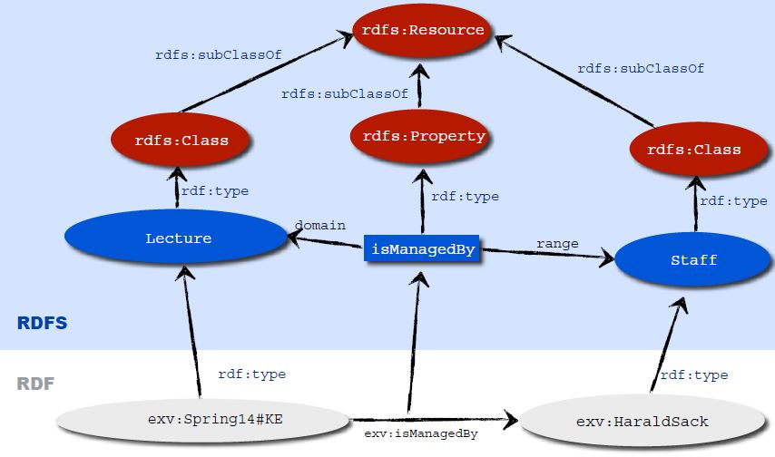

### RDFSchema allows following actions.

• Definition of classes

• Class instantiation in RDF via <rdf:type>

• Definition of properties and restrictions

• Definition of hierarchies

• Subclasses and superclasses

• Subproperties and superproperties

### There are two imporrant elements in RDF Schema, They are Classes and Properties.

#### 1. Classes are as follows.

  • rdfs:Class is Concept of a class, defines an abstract object and is applied (with rdf:type) to create instances
 
  • rdf:Propert is Base class for properties
  
  • rdfs:Literal is Class for literals
  
  • rdfs:Resource is every entity of an RDF model is instance of this class
  
  • and additionally,Threre are rdfs:Datatype, rdf:XMLLiteral, rdfs:Container, rdfs:ContainerMembershipProperty in Classes.

#### 2. Properties are as follows.

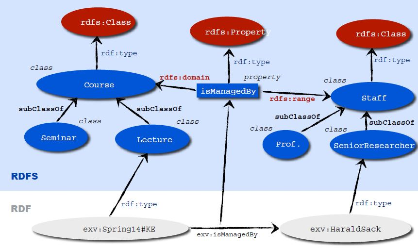

• rdfs:subClassOf is transitive property to define inheritance hierarchies for classes

• rdfs:subPropertyOf is transitive property to define inheritance hierarchies for properties

• rdfs:domain is defines the domain of a property concerning a class

• rdfs:range is defines range of a property concerning a class

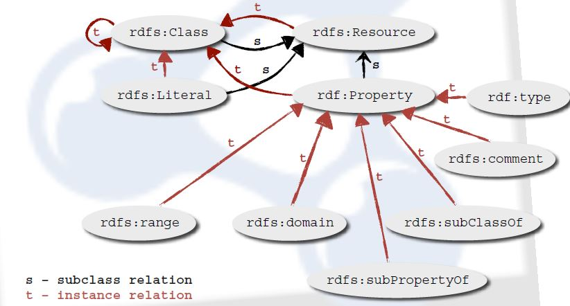

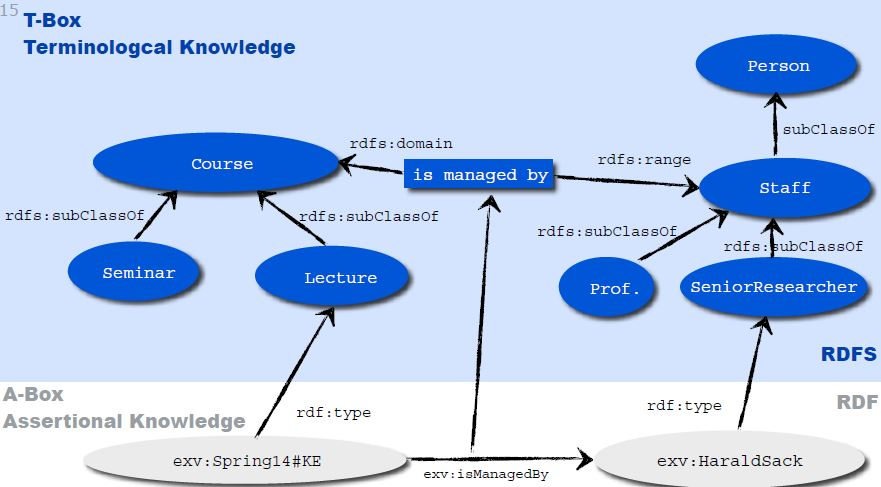

> @prefix rdf: <http://www.w3.org/1999/02/22-rdf-syntax-ns#> .  
> @prefix rdfs: <http://www.w3.org/2000/01/rdf-schema#> . 
> @prefix : <http://example.org/>. 
> :Lecture a rdfs:Class; 
> rdfs:subClassOf :Course. 
> :Seminar a rdfs:Class ; 
> rdfs:subClassOf :Course. 
> :Person a rdfs:Class . 
> :Staff a rdfs:Class ; 
> rdfs:subClassOf :Person . 
> :SeniorResearcher a rdfs:Class ; 
> rdfs:subClassOf :Staff . 
> :Professor a rdfs:Class ; 
> rdfs:subClassOf :Staff. 
> :isManagedBy a rdf:Property ; 
> rdfs:domain :Course ; 
> rdfs:range :Staff . 
> <Spring14#KE> a :Lecture . 
> :HaraldSack a :SeniorResearcher . 
> <Spring14#KE> :isManagedBy :HaraldSack .

### What conclusions can we deduce with RDF(S)?

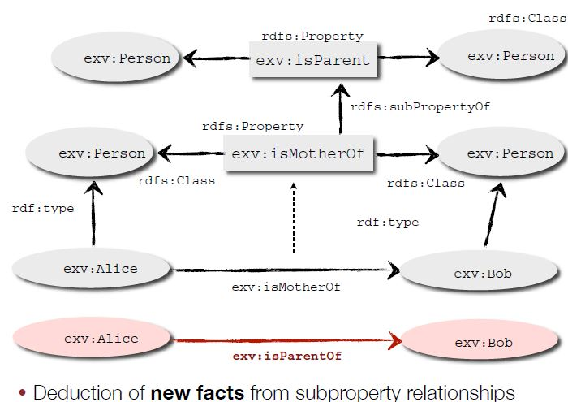

## SPARQL Progrmming
### Click Following link for further SPARQL(Protocol and RDF Query Language) Progamming !

#### 1. Select all authors with their notable works and year of publication  
<blockquote>  PREFIX rdf: <http://www.w3.org/1999/02/22-rdf-syntax-ns#>  
PREFIX rdfs: <http://www.w3.org/2000/01/rdf-schema#>  
PREFIX dbpedia-owl: <http://dbpedia.org/ontology/>  
PREFIX dbpprop: <http://dbpedia.org/property/>  
SELECT ?author ?work ?date  
FROM <http://dbpedia.org/>  
WHERE { 
&emsp; ?author rdf:type dbpedia-owl:Writer . 
&emsp; ?author dbpedia-owl:notableWork ?work . 
&emsp; ?work dbpprop:releaseDate ?date  
} ORDER BY ?date 
LIMIT 100         
</blockquote>

#### 2. Select all authors with their notable works and year of publication  
New variable is assigned using "xsd:integer(?date) AS ?year" in SELECT phrase.  
<blockquote>  PREFIX rdf: <http://www.w3.org/1999/02/22-rdf-syntax-ns#>  
PREFIX rdfs: <http://www.w3.org/2000/01/rdf-schema#>  
PREFIX dbpedia-owl: <http://dbpedia.org/ontology/>  
PREFIX dbpprop: <http://dbpedia.org/property/>  
SELECT ?author ?work xsd:integer(?date) AS ?year  
FROM <http://dbpedia.org/>  
WHERE { 
&emsp; ?author rdf:type dbpedia-owl:Writer . 
&emsp; ?author dbpedia-owl:notableWork ?work . 
&emsp; ?work dbpprop:releaseDate ?date  
} ORDER BY ?date 
LIMIT 100         
</blockquote> 

#### 3. Select all authors with their notable works and year of publication  
New variable is assigned using "(REPLACE(str(?date),"[^0-9]", "")) AS ?year" in SELECT phrase.  
<blockquote>  PREFIX rdf: <http://www.w3.org/1999/02/22-rdf-syntax-ns#>  
PREFIX rdfs: <http://www.w3.org/2000/01/rdf-schema#>  
PREFIX dbpedia-owl: <http://dbpedia.org/ontology/>  
PREFIX dbpprop: <http://dbpedia.org/property/>  
SELECT ?author ?work (REPLACE(str(?date),"[^0-9]", "")) AS ?year  
FROM <http://dbpedia.org/>  
WHERE { 
&emsp; ?author rdf:type dbpedia-owl:Writer . 
&emsp; ?author dbpedia-owl:notableWork ?work . 
&emsp; ?work dbpprop:releaseDate ?date  
&emsp; FILTER REGEX (?date, "[0-9]{4}") .
} ORDER BY ?date 
LIMIT 100         
</blockquote> 

#### 4. How many authors are there in DBpedia?  
<blockquote>PREFIX rdf: <http://www.w3.org/1999/02/22-rdf-syntax-ns#> 
PREFIX dbpedia-owl: <http://dbpedia.org/ontology/> 
SELECT (COUNT(?author)) AS ?num 
FROM <http://dbpedia.org/> 
WHERE { 
&emsp; ?author rdf:type dbpedia-owl:Writer . 
}
</blockquote> 

#### 5. How many distinct authors are there in DBpedia who have entries for notable works?  
Aggregate Functions : (COUNT(DISTINCT ?author))  
<blockquote>PREFIX rdf: <http://www.w3.org/1999/02/22-rdf-syntax-ns#> 
PREFIX dbpedia-owl: <http://dbpedia.org/ontology/> 
SELECT (COUNT(DISTINCT ?author)) AS ?num 
FROM <http://dbpedia.org/> 
WHERE { 
&emsp; ?author rdf:type dbpedia-owl:Writer . 
&emsp;?author dbpedia-owl:notableWork ?work . 
}
</blockquote>

#### 6. Which author wrote how many notable works?
<blockquote>Aggregate Functions : (COUNT(?work)), GROUP BY ?author 
PREFIX rdf: <http://www.w3.org/1999/02/22-rdf-syntax-ns#> 
PREFIX dbpedia-owl: <http://dbpedia.org/ontology/> 
SELECT ?author (COUNT(?work)) AS ?num_works 
FROM <http://dbpedia.org/> 
WHERE { 
&emsp; ?author rdf:type dbpedia-owl:Writer . 
&emsp; ?author dbpedia-owl:notableWork ?work . 
} GROUP BY ?author  
ORDER BY DESC (?num_works)
</blockquote>

#### 7. Select all authors, who they are influenced by and all the influencers notable works 
Subqueries :  
<blockquote>PREFIX rdf: <http://www.w3.org/1999/02/22-rdf-syntax-ns#> 
PREFIX dbpedia-owl: <http://dbpedia.org/ontology/> 
SELECT ?author ?influencer ?work 
FROM <http://dbpedia.org/> 
WHERE { 
{ SELECT ?author ?influencer 
&emsp; FROM <http://dbpedia.org/> 
&emsp; WHERE { 
&emsp; &emsp; ?author rdf:type dbpedia-owl:Writer . 
&emsp; &emsp; ?author dbpedia-owl:influencedBy ?influencer . 
} LIMIT 10 
} 
&emsp; ?influencer dbpedia-owl:notableWork ?work . 
}
</blockquote>

#### 8. Select all authors, who don‘t have a notable work entry in DBpedia  
Filtering of query solutions is done within a FILTER expression using NOT EXISTS and EXISTS. 
<blockquote>PREFIX rdf: <http://www.w3.org/1999/02/22-rdf-syntax-ns#> 
PREFIX dbpedia-owl: <http://dbpedia.org/ontology/> 
SELECT ?author 
FROM <http://dbpedia.org/> 
WHERE { 
&emsp; ?author rdf:type dbpedia-owl:Writer 
&emsp; FILTER NOT EXISTS {?author dbpedia-owl:notableWork ?work .} 
}
</blockquote>

#### 9.Select all authors, who don‘t have a notable work entry in DBpedia 
Filtering of query solutions be removing possible solutions with MINUS. 
<blockquote>PREFIX rdf: <http://www.w3.org/1999/02/22-rdf-syntax-ns#> 
PREFIX dbpedia-owl: <http://dbpedia.org/ontology/> 
SELECT ?author 
FROM <http://dbpedia.org/> 
WHERE { 
&emsp; ?author rdf:type dbpedia-owl:Writer 
&emsp; MINUS {?author dbpedia-owl:notableWork ?work .}  
}
</blockquote>

#### 10 Property Paths  
A property path is a possible route through an RDF graph between two graph nodes.

• trivial case: property path of length 1, i.e. a triple pattern

• alternatives: match one or both possibilities
&emsp; { :book1 dc:title|rdfs:label ?displayString }

• sequence: property path of length >1
&emsp; { ?x foaf:mbox <mailto:alice@example> . 
&emsp; &emsp; ?x foaf:knows/foaf:knows/foaf:name ?name . }

• inverse property paths: reversing the direction of the triple
&emsp; { ?x foaf:mbox <mailto:alice@example> } 
&emsp; &emsp;  = 
&emsp; { <mailto:alice@example> ^foaf:mbox ?x }

• inverse path sequences paths  
{ ?x foaf:knows/^foaf:knows ?y .  
&emsp; FILTER(?x != ?y) }
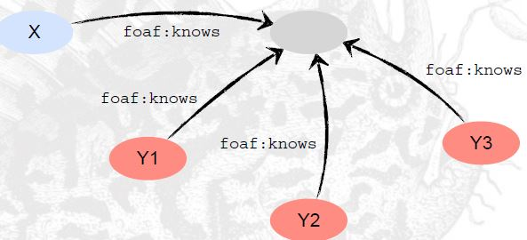

• arbitrary length match
{ ?x foaf:mbox <mailto:alice@example> . 
&emsp; ?x foaf:knows+/foaf:name ?name . }
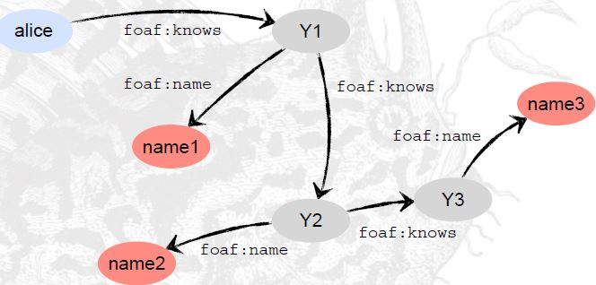

• inverse path sequences paths
&emsp; { ?x foaf:knows/^foaf:knows ?y . 
&emsp; &emsp; FILTER(?x != ?y) }

• arbitrary length match
&emsp; { ?x foaf:mbox <mailto:alice@example> .
&emsp; &emsp; ?x foaf:knows+/foaf:name ?name . }

• negated property paths
&emsp; { ?x !(rdf:type|^rdf:type) ?y } 

### Who are the authors who were influenced by the influencers of George Orwell?  
<blockquote>PREFIX : <http://dbpedia.org/resource/>  
PREFIX rdf: <http://www.w3.org/1999/02/22-rdf-syntax-ns#>  
PREFIX dbpedia-owl: <http://dbpedia.org/ontology/>  
SELECT ?influencedByInfluencers  
FROM <http://dbpedia.org/>  
WHERE {  
:George_Orwell   
dbpedia-owl:influencedBy/^dbpedia-owl:influencedBy  
?influencedByInfluencers .  
}
</blockquote>

## OWL(Web Ontology Language)

### What is Ontology and OWL(Web Ontology Language)?
RDF data can be encoded with semantic metadata using two syntaxes: RDFS(RDF Schema) and OWL.

Ontology classifies things in terms of semantics, or meaning into class or subclass, which allow us to define contextual relationship behind a defined vocabulary.

OWL is the formal syntax for defining ontologies and it is extension of RDFS(RDF Schema)

### Ontology axioms consist of the following three building blocks: 
• Classes : comparable with classes in RDFS 
• Individuals : comparable with objects in RDFS 
• Properties : comparable with properties in RDFS

1.OWL – Classes

• there exist two predefined classes

• owl:Thing (class that contains all individuals)

> owl:Nothing (empty class)
> Definition of a class  

> :Book a owl:Class .

2.OWL – Individuals

• Definition of individuals via class membership(a "NineteenEightyfour" Book instance generated)

> :NineteenEightyfour a :Book .

• Individuals can also be defined without direct class membership as named entity

> :HaraldSack a owl:NamedIndividual .

3.OWL – Properties

There exist two property variants: object properties and datatype properties

• Object properties are defined like classes 

> :author a owl:ObjectProperty .

&emsp; • Domain and Range of object properties 
<blockquote> :author a owl:ObjectProperty ;
&emsp; rdfs:domain :Book ; 
&emsp; rdfs:range :Writer .
</blockquote> 
 

### 1. OWL example
@prefix : <http://example.com/owl/> .
@prefix owl: <http://www.w3.org/2002/07/owl#> .
@prefix rdfs: <http://www.w3.org/2000/01/rdf-schema#> .
@prefix rdf: <http://www.w3.org/1999/02/22-rdf-syntax-ns#> .
@prefix xsd: <http://www.w3.org/2001/XMLSchema#> .
:HappyPerson a owl:Class ;
    owl:equivalentClass [
    a owl:Class ;
    owl:intersectionOf ([ a owl:Restriction ;
                                            owl:onProperty :hasChild ;
                                            owl:allValuesFrom :HappyPerson ]
                                         [ a owl:Restriction ;
                                           owl:onProperty :hasChild ;
                                           owl:someValuesFrom :HappyPerson ]
                                          )
                      ].

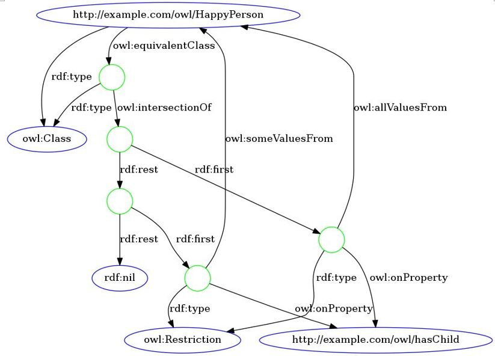

## [Click for further SPARQL Progamming !](https://github.com/blockchain99/SemanticWeb)

> Acknowledgement : Some images and articles are from other sites or materials: Amelie Gyrard: Christian Bonnet (Eurecom, Mobile Communication),Dr. Harald Sack : Hasso-Plattner-Institut for IT Systems Engineering, Dean Allemang : Semantic Web for the Working
Ontologist

## Meta
Yoonsu Park - http://www.patternics.com Distributed under the MIT license. See LICENSE for more information( https://en.wikipedia.org/wiki/MIT_License ). https://github.com/blockchain99/SemanticWeb
